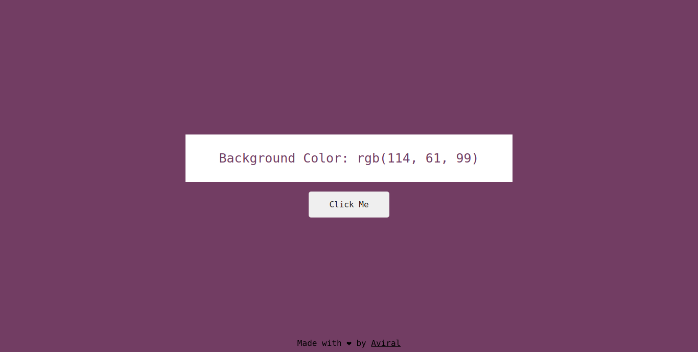
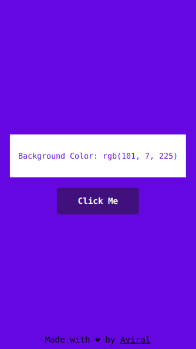

# Color Flipper

Color Flipper is a simple web application that allows users to generate random background colors with corresponding RGB values.

## Live Demo

Check out the live project [here](https://color-flipper-avi.netlify.app).

## Features

- Click the "Click Me" button to change the background color randomly.
- The RGB value of the generated color is displayed.
- Responsive design ensures a pleasant experience across various devices.

## Screenshots

## Technologies Used

- HTML
- CSS
- JavaScript

## Getting Started

1. Clone the repository: `git clone https://github.com/your-username/color-flipper.git`
2. Open `index.html` in your web browser.
3. Click the "Click Me" button to generate random colors.

## How to Contribute

If you'd like to contribute to this project, follow these steps:

1. Fork the repository.
2. Create a new branch: `git checkout -b feature-name`
3. Make your changes and commit them: `git commit -m 'Add some feature'`
4. Push to the branch: `git push origin feature-name`
5. Create a pull request.

## Acknowledgements

- [Aviral Sharma](https://github.com/aviralsharma07) - Project Creator

## Contact

If you have any questions or suggestions, feel free to contact me at [your@email.com].
